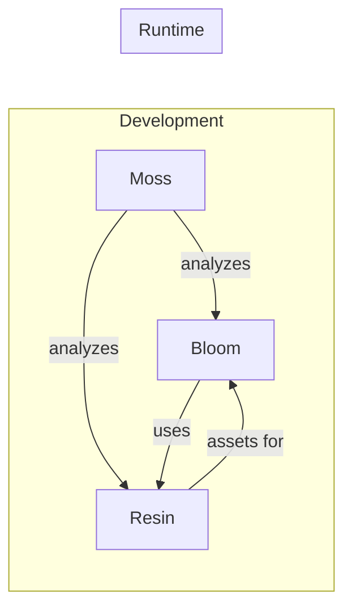

# About Rhizome Lab

Rhizome Lab builds tools for **programmable creativity**—software that treats code, worlds, and media as malleable structures rather than opaque artifacts.

## Philosophy

Our projects share common design principles:

### Generalize, Don't Multiply

Prefer one flexible solution over many specialized ones. Composability reduces cognitive load and maintenance burden.

- **Moss**: Three primitives (view, edit, analyze) instead of 100 specialized tools
- **Bloom**: Generic entity system that can power games, knowledge bases, or productivity tools
- **Resin**: Unified `Field<I, O>` trait for textures, audio, and any continuous domain

### Structure Over Text

Return structure, not prose. Structured data composes; text requires parsing.

Hierarchy implies trees. Code (AST), files (directories), entities (graphs), media (node graphs)—design operations that work on these structures directly.

### Lazy by Default

Build descriptions, evaluate on demand. Don't pay for what you don't use.

- **Resin**: Procedural textures and audio are lazy fields, materialized only when rendered
- **Moss**: Skeleton views extract structure without loading entire files
- **Bloom**: Entity properties are computed on access, not upfront

### Plugin Architecture

Optional, domain-specific, or heavyweight features belong in plugins:

- Core stays lean
- Heavy dependencies are isolated
- Users can swap implementations
- Third-party extensions use the same interfaces as built-in features

### Works Anywhere

Real-world code is messy. Real-world data is heterogeneous. Tools should:

- Handle legacy systems without requiring refactoring first
- Degrade gracefully when parsing fails
- Support incremental improvement
- Not impose architectural opinions unless asked

## The Name

A rhizome is a root system that grows horizontally, sending out shoots at intervals. Unlike trees with a single trunk, rhizomes form interconnected networks where any point can connect to any other.

Our projects are designed the same way: independent tools that compose well together, each useful alone but more powerful in combination.

## Projects

| Project | Domain | Key Idea |
|---------|--------|----------|
| [Moss](/projects/moss) | Code intelligence | AST-aware navigation and editing across 98 languages |
| [Bloom](/projects/bloom) | Persistent worlds | LambdaMOO-inspired entity system with Lua scripting |
| [Resin](/projects/resin) | Media generation | Composable procedural primitives for meshes, audio, textures |

## Integration

The projects are designed to work together:

- **Moss** provides code intelligence for developing Bloom and Resin
- **Resin** generates procedural assets (textures, meshes, audio) for Bloom worlds
- **Bloom** can host interactive editors for Resin node graphs
