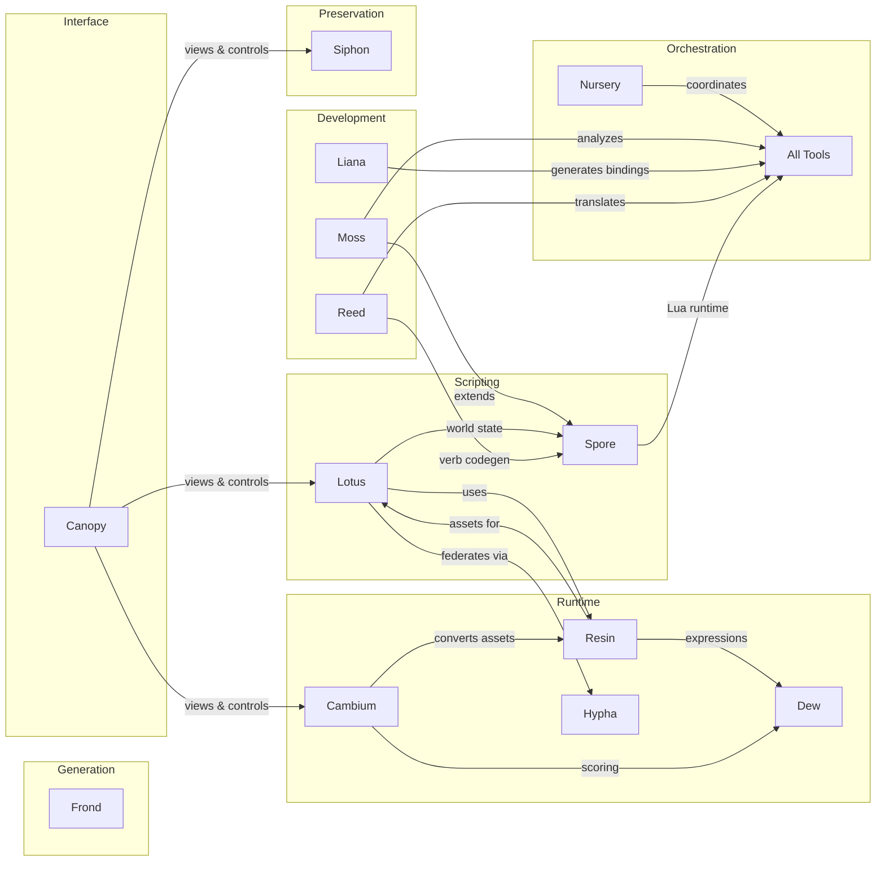

# About Rhizome

Rhizome is an ecosystem of tools for **programmable creativity**—software that treats code, worlds, and media as malleable structures rather than opaque artifacts.

## Philosophy

The projects share common design principles:

### Generalize, Don't Multiply

Prefer one flexible solution over many specialized ones. Composability reduces cognitive load and maintenance burden.

- **Moss**: Three primitives (view, edit, analyze) instead of 100 specialized tools
- **Lotus**: Generic entity system that can power games, knowledge bases, or productivity tools
- **Resin**: Unified `Field<I, O>` trait for textures, audio, and any continuous domain

### Structure Over Text

Return structure, not prose. Structured data composes; text requires parsing.

Hierarchy implies trees. Code (AST), files (directories), entities (graphs), media (node graphs)—design operations that work on these structures directly.

### Lazy by Default

Build descriptions, evaluate on demand. Don't pay for what you don't use.

- **Resin**: Procedural textures and audio are lazy fields, materialized only when rendered
- **Moss**: Skeleton views extract structure without loading entire files
- **Lotus**: Entity properties are computed on access, not upfront

### Plugin Architecture

Optional, domain-specific, or heavyweight features belong in plugins:

- Core stays lean
- Heavy dependencies are isolated
- Users can swap implementations
- Third-party extensions use the same interfaces as built-in features

### Works Anywhere

Real-world code is messy. Real-world data is heterogeneous. Tools should:

- Handle legacy systems without requiring refactoring first
- Degrade gracefully when parsing fails
- Support incremental improvement
- Not impose architectural opinions unless asked

## The Name

A rhizome is a root system that grows horizontally, sending out shoots at intervals. Unlike trees with a single trunk, rhizomes form interconnected networks where any point can connect to any other.

Our projects are designed the same way: independent tools that compose well together, each useful alone but more powerful in combination.

## Projects

| Project | Domain | Key Idea |
|---------|--------|----------|
| [Moss](/projects/moss) | Code intelligence | AST-aware navigation and editing across 98 languages |
| [Lotus](/projects/lotus) | Persistent worlds | LambdaMOO-inspired entity system with Lua scripting |
| [Hypha](/projects/hypha) | Federation | Authoritative handoff protocol for interconnected worlds |
| [Resin](/projects/resin) | Media generation | Composable procedural primitives for meshes, audio, textures |
| [Frond](/projects/frond) | Game primitives | State machines, controllers, common gameplay patterns |
| [Dew](/projects/dew) | Expressions | Minimal expression language (WGSL, Cranelift, Lua) |
| [Liana](/projects/liana) | API bindings | IR and codegen for cross-language bindings |
| [Cambium](/projects/cambium) | Pipelines | Type-driven route planning for data conversion |
| [Canopy](/projects/canopy) | UI | Universal client with control plane for any data source |
| [Siphon](/projects/siphon) | Preservation | Legacy software lifting from obsolete runtimes |
| [Nursery](/projects/nursery) | Orchestration | Schema-controlled tool composition via manifests |
| [Spore](/projects/spore) | Runtime | Lua runtime with plugin system for ecosystem integration |
| [Reed](/projects/reed) | Translation | Source → IR → source across languages |

## Integration

The projects are designed to work together:

- **Nursery** coordinates tools via schema-validated manifests
- **Moss** provides code intelligence for all projects
- **Reed** provides bidirectional translation between languages
- **Spore** provides Lua runtime with integrations for **Moss** and **Lotus**
- **Lotus** runs persistent worlds, federates via **Hypha**
- **Hypha** enables authoritative handoff between Lotus servers
- **Resin** uses **Dew** for procedural expressions, generates assets for **Lotus**
- **Frond** provides game design primitives
- **Cambium** orchestrates asset conversion pipelines
- **Liana** generates API bindings across the ecosystem
- **Canopy** provides UI for viewing and controlling any project
- **Siphon** lifts legacy software into modern web runtimes
