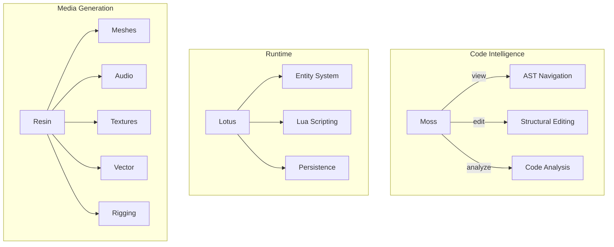
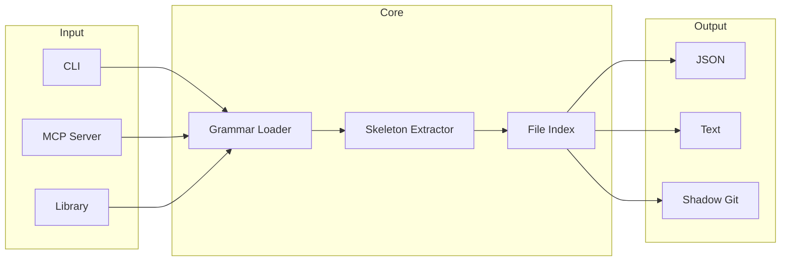
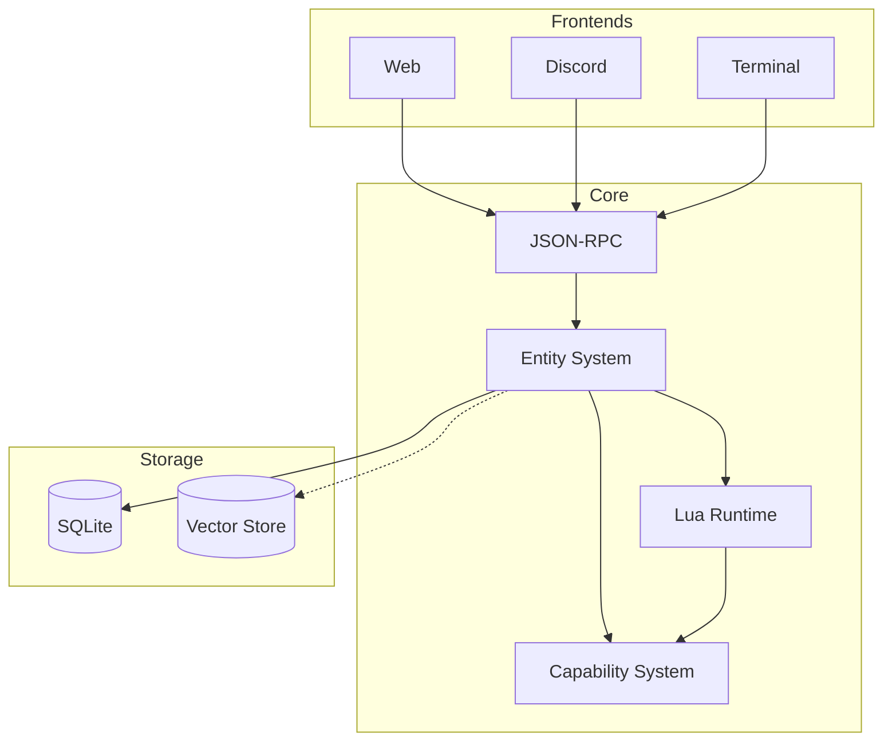
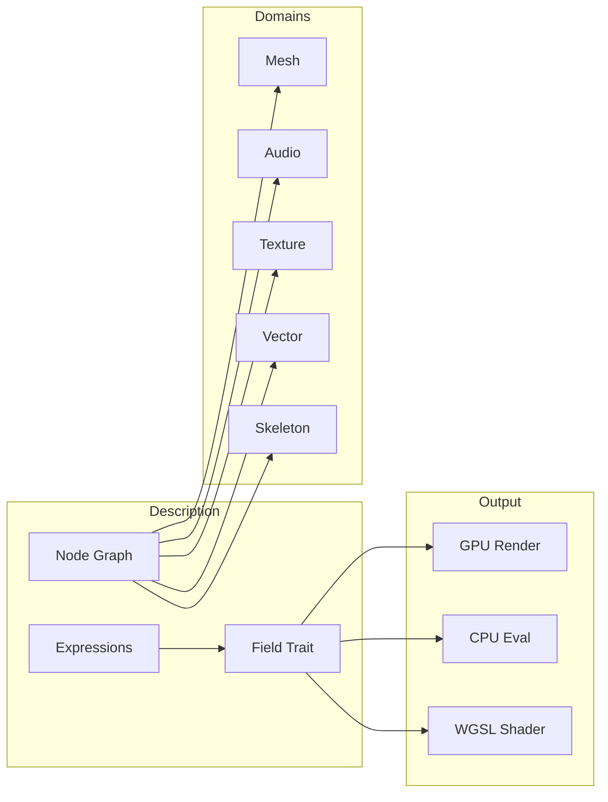
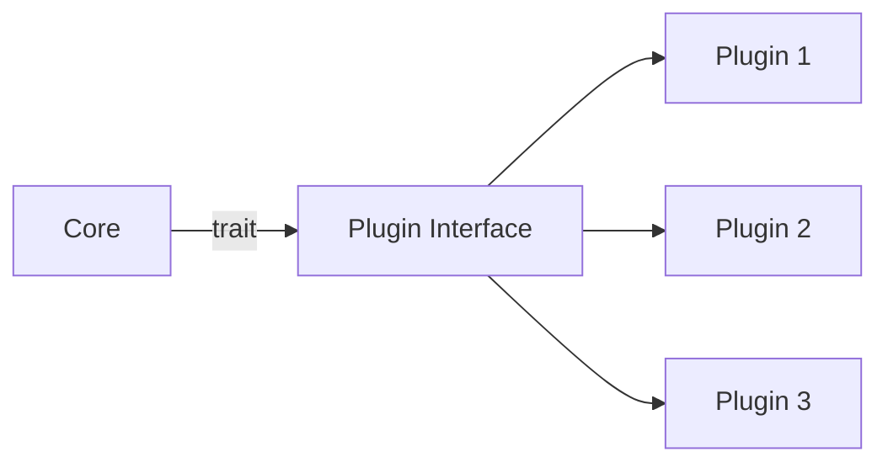
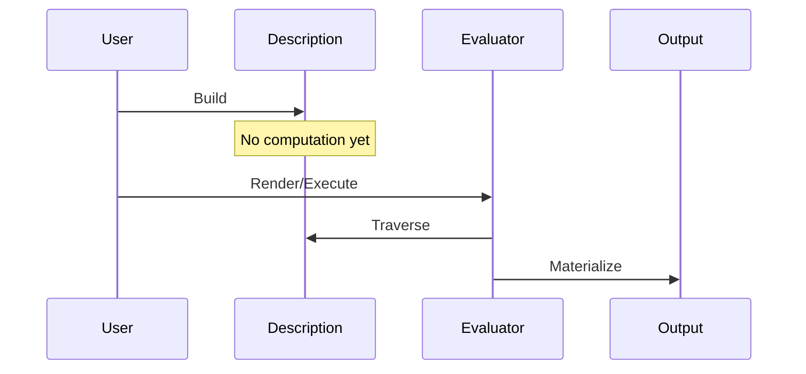
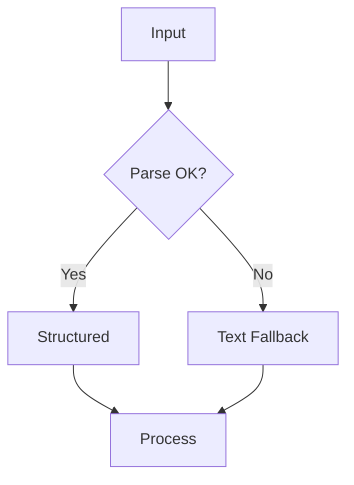

# Architecture Overview

How Rhizome projects are structured and how they relate.

## Project Landscape

## Moss Architecture

Structural code intelligence with three primitives:

Key components:
- **Grammar Loader**: Dynamic `.so` loading for 98 tree-sitter grammars
- **Skeleton Extractor**: AST → structured output (signatures, dependencies, calls)
- **File Index**: SQLite symbol/call graph with background daemon
- **Shadow Git**: Hunk-level edit tracking in `.moss/.git`

## Lotus Architecture

Persistent multiplayer world runtime:

Key components:
- **Entity System**: Flexible `props` JSON store for infinite extensibility
- **Lua Runtime**: Sandboxed scripting for object behaviors
- **Capability System**: Fine-grained permissions per entity
- **JSON-RPC**: Headless core, any frontend can connect

## Resin Architecture

Constructive media generation with lazy evaluation:

Key components:
- **Node Graph**: Type-safe connections with topological execution
- **Field Trait**: Lazy evaluation for continuous domains
- **Expression System**: AST with optional JIT compilation
- **Domain Crates**: Independent crates per media type

## Shared Patterns

All projects follow common architectural patterns:

### Plugin Architecture

Core defines contracts; plugins provide implementations. Built-in features use the same interface as third-party extensions.

### Lazy Evaluation

Build descriptions, evaluate on demand. Defer computation until needed.

### Graceful Degradation

Handle messy real-world data. Fall back gracefully when parsing fails.
