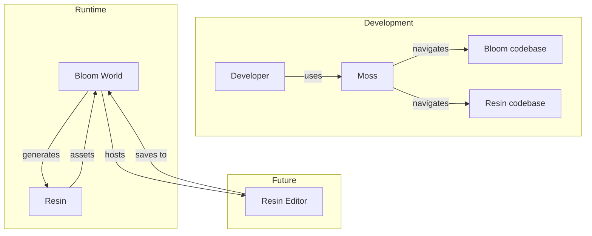
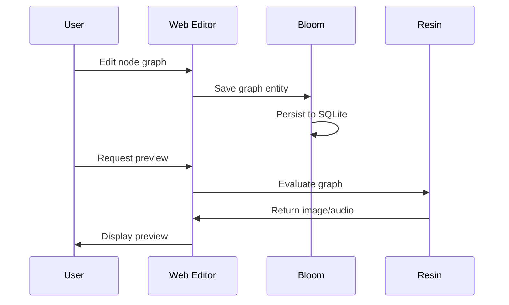

# Integration

How Rhizome Lab projects work together.

## Overview

While each project is useful standalone, they're designed to compose:



## Moss + Any Project

Moss provides code intelligence for any Rust or TypeScript codebase:

```bash
# Navigate Bloom's entity system
moss view bloom/crates/core/src/entity.rs

# Find all Lua bindings in Bloom
moss view bloom/ --calls "lua.*"

# Analyze Resin's complexity hotspots
moss analyze resin/crates/ --complexity

# Search for trait implementations
moss view resin/ --type impl
```

## Resin + Bloom

Resin generates procedural assets that Bloom worlds can use:

### Procedural Textures for Rooms

```rust
// Resin: Generate a procedural wall texture
let wall = perlin()
    .scale(8.0)
    .remap(-1.0, 1.0, 0.3, 0.7)
    .colorize(gradient![
        0.0 => rgb(0.2, 0.15, 0.1),
        1.0 => rgb(0.4, 0.35, 0.3),
    ]);

wall.render(512, 512).save("wall.png");
```

```lua
-- Bloom: Use the texture in a room
room.texture = "/assets/wall.png"
```

### Procedural Audio for Ambience

```rust
// Resin: Generate ambient sounds
let wind = noise_osc(NoiseType::Pink)
    .filter(lowpass(200.0))
    .amplitude(0.3);

let rain = impulse_train(8.0)
    .filter(bandpass(2000.0, 0.5))
    .amplitude(0.1);

mix(wind, rain).render_to("ambience.wav", 44100, 10.0);
```

### Procedural Meshes for Objects

```rust
// Resin: Generate a procedural gem
let gem = icosphere(2)
    .deform(|p| p + noise3d(p * 3.0) * 0.1)
    .extrude_faces(0.1);

gem.export("gem.glb");
```

## Future: Bloom Hosts Resin Editor

A longer-term integration: Bloom as a persistent backend for a Resin node graph editor.



Benefits:
- **Persistence**: Graph saved as Bloom entity with full history
- **Collaboration**: Multiple users edit the same graph
- **Scripting**: Lua scripts can manipulate graphs programmatically
- **Versioning**: Entity revision history provides undo/branching

## Library Usage

All projects expose their core as Rust libraries:

```toml
# Cargo.toml
[dependencies]
moss = { git = "https://github.com/rhizome-lab/moss" }
bloom-core = { git = "https://github.com/rhizome-lab/bloom" }
resin = { git = "https://github.com/rhizome-lab/resin" }
```

This allows building custom tools that combine capabilities:

```rust
use moss::view::skeleton;
use resin::texture::perlin;
use bloom_core::entity::Entity;

// Analyze code structure, generate assets, store in world
```
